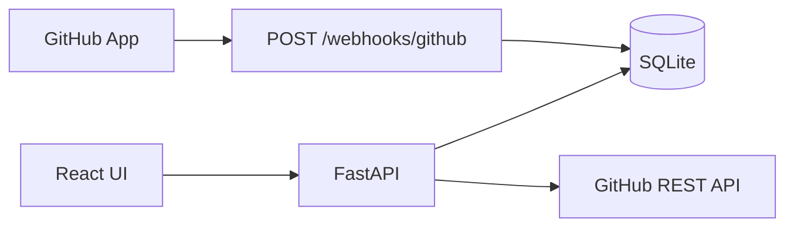

# Architecture

## Components

| Layer | Path | Role |
|-------|------|------|
| Frontend | `frontend/` | React (Vite) study hub UI |
| API | `backend/app/main.py` | FastAPI REST + GitHub webhooks |
| Data | `data_model/` + `data/ccna_study.db` | Schema, seed, domain map |
| MGM reports | `send_reports.py` | Webex daily status (GitHub Actions) |

## Data flow

## GitHub App

1. Register a GitHub App with webhook URL `https://<host>/webhooks/github`.
2. Subscribe to `installation`, `push`, `pull_request` (as needed).
3. Set `GITHUB_APP_ID`, `GITHUB_WEBHOOK_SECRET`, and private key in `.env`.
4. Install the app on a repository; events appear in `GET /api/github/events`.

Installation tokens: `POST /api/github/installations/{id}/token` (server-side only).

## Python version

Use **Python 3.10–3.13** (3.14 may fail to build `pydantic-core` wheels). CI uses 3.11.
